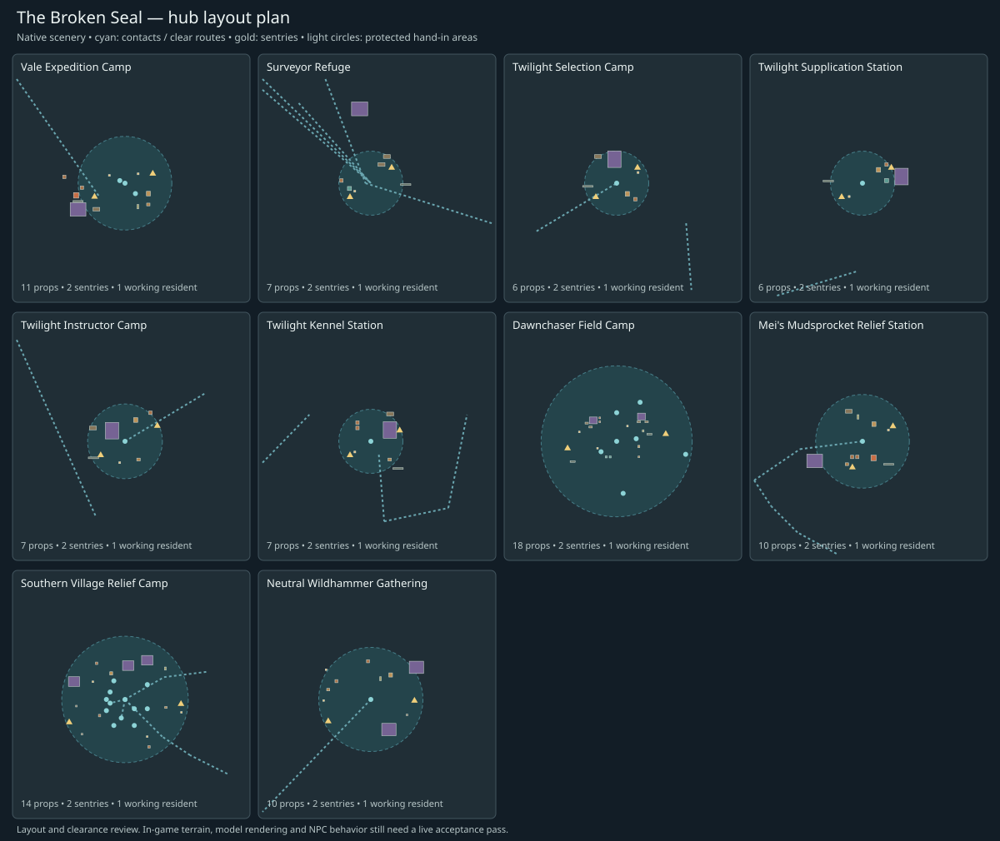

# Quest hubs: safety, camp layout and installation

The shared hub add-on upgrades the implemented Chapters 1–4: **ten protected
hand-in/resting areas**, **96 native scenery placements**, **20 sentries** and
**ten working residents**. Shelters, bedding, storage, work areas, lights and
entrance markers give each camp a purpose. Camp guards and a localized ambient-mob
rule protect the quest contacts, resting circles and the scenery footprints.

[Layout plan](hub-layout.svg) · [Implementation manifest](../../data/quests/broken_seal_hubs.json)



The drawing is a placement plan. Native model appearance, lighting, terrain seams
and actual in-game behavior still need the client acceptance pass below. No full
worldserver build, realm deployment or in-game visual inspection was performed.

## What changed

- The Vale expedition has sleeping/supply space, a map/work table, fire, equipment,
  lighting and stationed sentries. Its NPC approach and Jarod's arrival stay clear.
- The surveyor refuge has a shelter, bedding, medical supplies and a volunteer.
  The captive and riot escape routes pass through clear lanes.
- The four cult stations form a coherent camp: dark Shadow Council canvas shelters,
  stores, training equipment, remedy tables and lighting. Public quest enemies were
  moved away from the hand-in areas; the course and hound routes remain open.
- The Dawnchaser field camp has added lodging, bedding, medicine/storage, work areas
  and staffed entrances around the existing medical tent and kitchen. Its protection
  remains active for Chapter 2's Dezco handoff even if Chapter 3 is disabled.
- Mei's relief station was moved from the Firemane pocket onto the Mudsprocket
  approach. A shelter, kitchen, table, stores and lighting connect her role to the
  existing settlement setting.
- Chapter 4 adds a village relief compound on Mudsprocket's southern edge and a
  neutral Wildhammer gathering in the Hinterlands, each with native dwarf canvas
  shelters, working supplies, lamps, equipment and two sentries.

The native-spawn audit found a basilisk about five metres from Condenna, overlapping
harpy roam envelopes near the refuge, and a Firemane about eleven metres from Mei's
old position. **22 ordinary native spawn homes** receive conditional clearances,
with their identities, movement types and wander radii preserved. Shared patrol
paths are audited and retained. The audited snapshot had no eligible patrol segments
crossing these resting areas; the runtime rule handles ordinary later additions too.

## Protection behavior

Inside a registered resting circle or a scenery footprint plus its two-metre access
margin, PCs and their controlled units cannot initiate or receive damage from
eligible ambient NPCs. Their pairwise reaction is friendly while protected. Global
player factions and PvP flags remain unchanged. NPC damage already in flight is
suppressed when the source is an eligible creature and still resolvable.

Sentries scan once per second and send eligible intruders into their normal evade/
return-home behavior. Evade clears threat, loot recipients and player-damage tags;
sentries grant no kill credit, XP or loot. Camp protection therefore cannot be used
to farm mobs through guard kills.

Eligibility is deliberately bounded: static, living, ordinary hostile NPCs with
no player owner, summon status, quest/service flags or boss/elite status. Unknown
custom-scripted creatures are excluded. The explicitly listed ordinary public
campaign mobs can also be driven away; private summoned quest enemies remain active.
This preserves the hound match, Garnoth duel, prisoner rescue and enforcer waves,
including the wave at the refuge and Chapter 4 mask/boss encounters. Opposing-faction town guards, PvP, pets, bosses,
rare encounters and other scripted events retain their normal behavior.

The camp geometry uses horizontal range plus vertical tolerance and matching map/
phase. Underground, airborne or different-phase objects do not inherit a broad
world-wide safe-zone effect. The faction introduction couriers use their existing
native settlements; bound Jarod's altar is recorded as a deliberate encounter area.

## Registered areas

| Area | Activation | Hand-in radius | Sentry screen | Scenery |
|---|---|---:|---:|---:|
| Vale Expedition Camp | Chapter 1 | 18 m | 36 m | 11 |
| Surveyor Refuge | Chapter 1 | 12 m | 30 m | 7 |
| Twilight Selection Camp | Chapter 2 | 12 m | 30 m | 6 |
| Twilight Supplication Station | Chapter 2 | 12 m | 30 m | 6 |
| Twilight Instructor Camp | Chapter 2 | 14 m | 32 m | 7 |
| Twilight Kennel Station | Chapter 2 | 12 m | 30 m | 7 |
| Dawnchaser Field Camp | Chapter 2 | 58 m | 76 m | 18 |
| Mei's Mudsprocket Relief Station | Chapter 3 | 18 m | 36 m | 10 |
| Southern Village Relief Camp | Chapter 4 | 34 m | 52 m | 14 |
| Neutral Wildhammer Gathering | Chapter 4 | 22 m | 40 m | 10 |

Scenery footprints extend coverage beyond the small central circles where needed.
Sentry template IDs are **4009000–4009009**, resident IDs **4009050–4009059**, and
scenery IDs **4009100–4009195**. The add-on owns these resources as chapter `0` in
`mod_customnpcs_bs_content`. Each model and outfit item exists in native Wrath data.

## Install

1. Include the updated module in a worldserver rebuild. The loader registers
   `AddBrokenSealHubScripts`.
2. Install the appearance schema and all four chapter SQL files, then apply
   [broken_seal_hubs.sql](../../data/sql/db-world/base/broken_seal_hubs.sql) to the
   **world** database. Existing installations can use the identical
   [hub update](../../data/sql/db-world/updates/2026_10_07_02_broken_seal_chapter4_hubs.sql).
3. Enable `ModCustomNPCs.Enable`, `ModCustomNPCs.Appearance.Enable`, the relevant
   chapter options and **`ModCustomNPCs.BrokenSeal.Hubs.Enable = 1`**, then restart.

```bash
mysql -u<user> -p acore_world < data/sql/db-world/base/broken_seal_hubs.sql
```

For Chapters 1–3 only, the historical `2026_10_06_03` update remains unchanged.
Install Chapter 4 before the current full hub base or expansion update. Older hub
GUIDs and original native backups are retained during the upgrade.

No client patch is required. With appearances disabled, sentries/residents retain
valid fallback displays. Disabling the hub option stops runtime protection and
sentry behavior; installed scenery and cleared spawn homes remain in place.

The import checks chapter prerequisites and unowned custom-ID collisions before
content changes. Intentional duplicate-key errors mean those checks failed; do not
bypass them with `mysql --force`. Both native `creature.id1` and legacy `creature.id`
schemas are supported. Reapplication preserves the add-on's GUIDs and per-spawn
outfit overrides.

Native moves match the audited GUID, creature identity, map and original position,
and exclude changed scripts/service/elite roles. Their actual original coordinates
are saved in `mod_customnpcs_bs_hub_native`. A realm placement already moved elsewhere
is left alone; a later administrator placement is preserved on reimport. Native
creatures, loot and templates are retained. The existing chapter files and this
add-on apply the same campaign spawn adjustments and Mei position.

For manual native-home restoration use
[restore_broken_seal_hub_native_spawns.sql](../../data/sql/support/restore_broken_seal_hub_native_spawns.sql).
It restores only still-matching applied positions and preserves subsequent edits.
Backups remain available, and reapplying the add-on can safely reapply clearances.
This support file is outside the automatic base/update import folders.

## Verification

Passed: **30 campaign/hub/outfit tests**, standalone camp boundary/exclusion
checks, C++ syntax checks against the local core, native assets, **126 scenery/staff
ground positions**, footprint slope/overlap checks, contact access and **24 clear
escort/course/hound/approach segments**. SQL fixtures passed both creature schemas,
GUID preservation, native identity and wander/movement preservation, operator
placement overrides, backup/restoration/reimport, occupied-ID guards and missing-
chapter rejection. These checks use disposable databases and do not touch a realm.

```bash
python3 tools/generate_broken_seal_hubs.py --check
python3 -m unittest discover -s tests -p 'test_broken_seal*.py'
clang++ -std=c++20 -Wall -Wextra -Werror -Isrc tests/broken_seal_hubs_tests.cpp -o /tmp/bs-hub-policy
/tmp/bs-hub-policy
python3 tools/verify_broken_seal_hub_assets.py --client-data /path/to/data --nav-probe /path/to/nav_probe
python3 tools/verify_broken_seal_hub_sql.py --core-root /path/to/core --socket /path/to/test.sock
```

The standalone [navigation probe](../../tools/broken_seal_nav_probe.cpp) can be
compiled against the core's Detour headers/sources. Filter `1` checks ground;
filter `9` allows ground/water travel. The optional third probe argument selects
map `0` or `1`; the default remains map `1`. The source audit is rerunnable with
[the hub audit tool](../../tools/audit_broken_seal_hubs.py); `--write` updates its
manifest evidence and selected clearances. The core base snapshot hash is recorded.

A full stock-client acceptance run is still required:

1. Walk each hub as Alliance and Horde at the appropriate level. Wait for ordinary
   roamers, enter with an existing NPC attack/DoT, test pets, leave the boundary and
   verify normal combat returns. Test guards through obstacles and at scenery edges.
2. Confirm private hound/Garnoth/escape battles still function, including enforcers
   at the refuge. Confirm PvP, town guards, bosses and unrelated scripts are unchanged.
3. Check every tent, bedroll, workstation, supply cluster and lamp from ground-level
   camera angles. Verify orientation, terrain contact, native model rendering, props
   clipping existing trees/buildings, contact access and staffed work areas.
4. Run all three captive escorts, Jarod's full escape, the timed course and hound
   feeding route with the new scenery. Check navigation around real collision models.
5. Play the Dawnchaser birth/vigil scenes and food deliveries. Confirm the tent still
   screens the delivery and Mei's updated route/quest map agrees with her placement.
6. Run Chapter 4's escort, all eight mask treatments, finale and hearth restoration.
   Verify private fights remain active and Horde can reach Iain without town-guard aggro.
7. Reapply SQL on a staging realm and test `.reload config`. Inspect custom realm
   patrols or spawns beyond the audited snapshot before deploying to that realm.

## Standard for future hubs

Every new public quest hub must be registered here, or explicitly documented as an
existing native settlement or deliberate encounter area. A complete resting hub
needs shelter, supplies, lighting and a real work/medical/equipment area, with clear
NPC approach lanes, stationed sentries and a working resident. Link these elements
to the faction's purpose and the terrain rather than scatter generic props.

Before adding it: audit native homes, wander ranges, aggro ranges and actual patrol
segments; retain shared paths and quest dependencies; move only justified ordinary
spawn homes with backup and identity checks; validate native models and footprint
slopes; reserve scene/escort/courier paths; and inspect the result in-game. Register
ordinary scripted campaign enemies explicitly while keeping private encounters out
of ambient protection. Preserve PvP and owner/pet behavior.

The generator rejects current public quest contacts that lack coverage or a recorded
exception, and enforces the functional scenery/staff contract. These rules apply to
the following chapters as their hubs are authored; their full implementation and
live appearance validation remain separate work.
